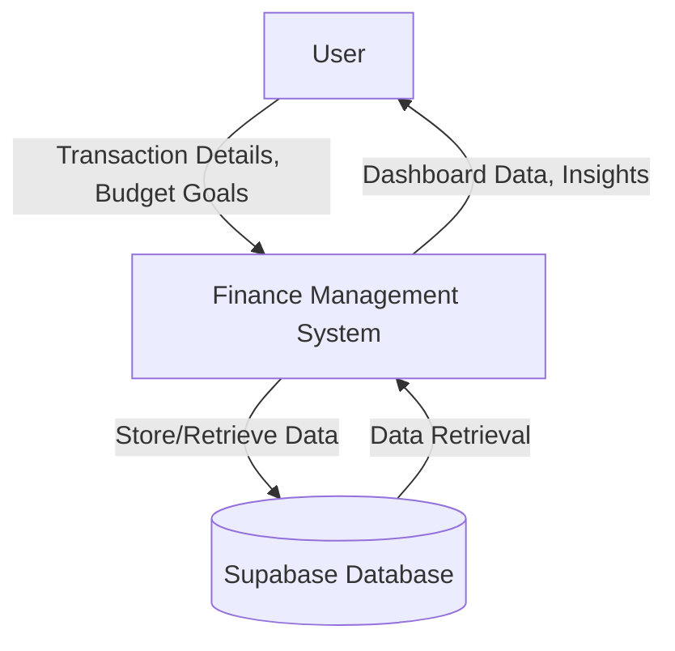
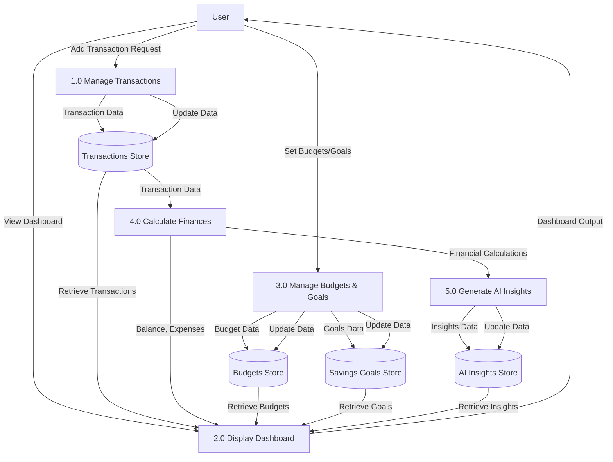

# Data Flow Diagrams for Pixie Fin Pal

## Level 0 DFD (Context Diagram)

This diagram shows the system as a single process interacting with external entities.

## Level 1 DFD

This diagram decomposes the system into main processes.

## Notes
- **Processes**: Represented by circles (e.g., 1.0 Manage Transactions).
- **Data Stores**: Represented by rectangles with double lines (e.g., (Transactions Store)).
- **External Entity**: User (square).
- **Data Flows**: Arrows showing data movement.
- Level 0 provides an overview; Level 1 shows decomposition into subprocesses.
- Data stores are based on the entities from the ER diagram (Transactions, Budgets, Savings Goals, AI Insights).

To render these diagrams, copy the Mermaid code into a compatible viewer like https://mermaid.live or GitHub.
