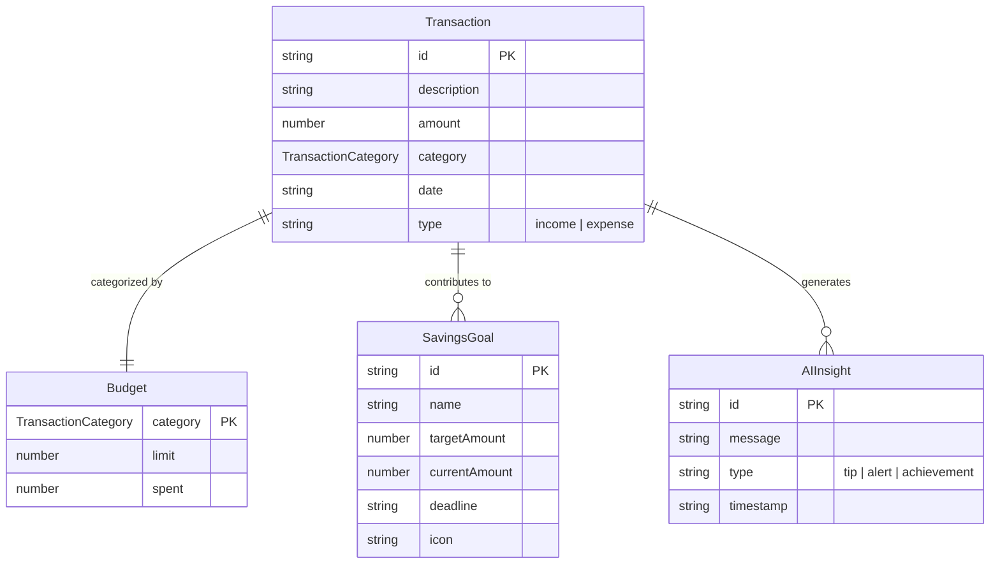

# Entity-Relationship Diagram for Pixie Fin Pal

This ER diagram represents the data model for the finance application based on the TypeScript types defined in `src/types/finance.ts`. The application uses Supabase for backend, but the current schema is empty, so this is inferred from the frontend types and mock data.

## Notes
- **Transaction**: Represents individual financial transactions (income or expense).
- **Budget**: Tracks spending limits and actual spend per category. Derived from transactions.
- **SavingsGoal**: User-defined goals for saving money.
- **AIInsight**: AI-generated tips, alerts, or achievements based on transaction data.
- Relationships are inferred from the data structure; actual database relationships may vary once the Supabase schema is populated.
- Categories are enums, not separate entities, as defined in `TransactionCategory`.

To render this diagram, copy the Mermaid code into a Mermaid-compatible viewer (e.g., GitHub, Mermaid Live Editor).
