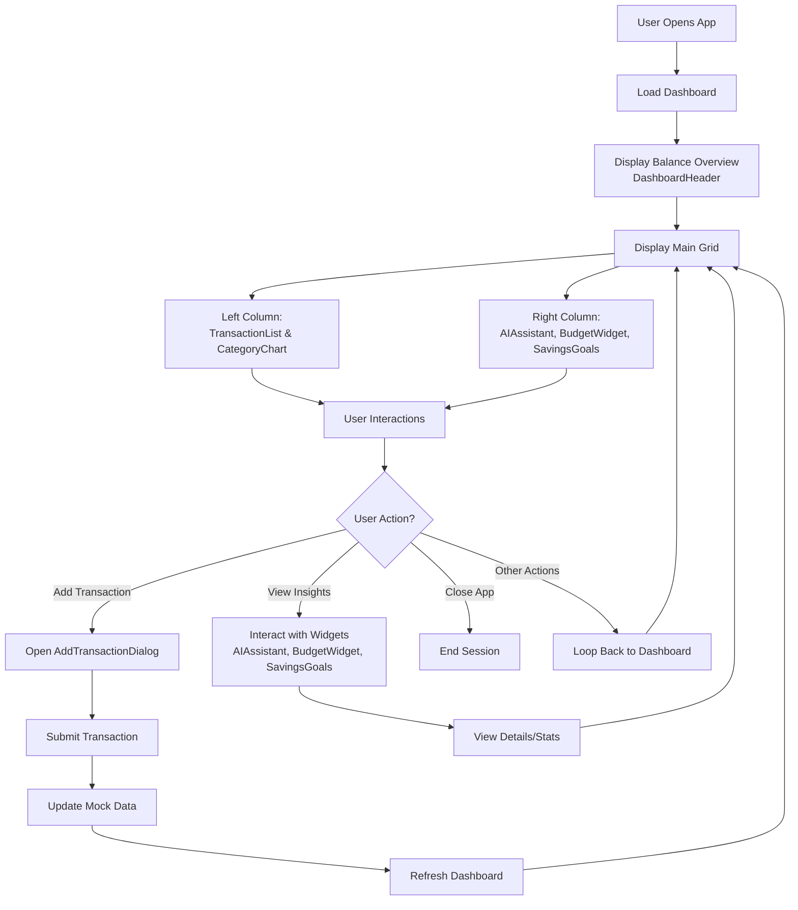

# Flow Chart for Pixie Fin Pal

This flow chart represents the main user journey in the finance application based on the React components and interactions defined in the codebase.

## Notes
- **Dashboard**: Main view with balance, transactions, charts, budgets, goals, and AI insights.
- **Interactions**: Users can add transactions, view category charts, check budgets, track savings goals, and receive AI insights.
- **Data**: Currently uses mock data; in production, this would connect to Supabase.
- **Loops**: The app allows continuous interaction, looping back to the dashboard after actions.

To render this as an image, copy the Mermaid code into a compatible renderer like https://mermaid.live or GitHub.
