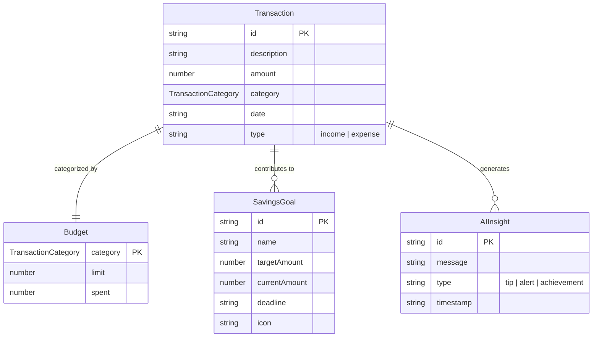

# Pixie Fin Pal - Project Documentation

## 3. Project Description

Pixie Fin Pal is a modern, user-friendly web application designed to help users manage their personal finances effectively. Built as a single-page application (SPA) using React and TypeScript, it provides a comprehensive dashboard for tracking income, expenses, budgets, savings goals, and AI-powered insights. The app aims to simplify financial management by offering intuitive visualizations, real-time calculations, and personalized recommendations.

Key features include:
- **Dashboard Overview**: Displays total balance, monthly income, and expenses.
- **Transaction Management**: Add, view, and categorize transactions (income/expense).
- **Budget Tracking**: Set and monitor spending limits per category.
- **Savings Goals**: Track progress towards financial goals with visual indicators.
- **AI Insights**: Receive tips, alerts, and achievements based on spending patterns.
- **Category Charts**: Visualize spending distribution using interactive charts.

The application uses mock data for demonstration but is designed to integrate with Supabase for production data storage and retrieval.

### 3.1 Data Base

The application utilizes Supabase as its backend database, which is built on PostgreSQL. Supabase provides real-time capabilities, authentication, and API endpoints for seamless data management. Currently, the database schema is empty in the provided configuration, but the application is structured to support tables for transactions, budgets, savings goals, and AI insights. In production, Supabase handles data persistence, user authentication, and real-time updates.

Database connection is established via the Supabase client (`src/integrations/supabase/client.ts`), which uses environment variables for URL and API key.

### 3.2 Table Description

Based on the TypeScript types defined in `src/types/finance.ts`, the following tables are inferred for the database:

1. **Transactions Table**:
   - `id` (string, Primary Key): Unique identifier for each transaction.
   - `description` (string): Brief description of the transaction.
   - `amount` (number): Transaction amount.
   - `category` (enum): Category from predefined list (e.g., 'Food & Dining', 'Income').
   - `date` (string): Date of the transaction (ISO format).
   - `type` (enum): 'income' or 'expense'.

2. **Budgets Table**:
   - `category` (enum, Primary Key): Category for the budget.
   - `limit` (number): Budget limit for the category.
   - `spent` (number): Amount spent in the category.

3. **Savings Goals Table**:
   - `id` (string, Primary Key): Unique identifier for the goal.
   - `name` (string): Name of the savings goal.
   - `targetAmount` (number): Target amount to save.
   - `currentAmount` (number): Current saved amount.
   - `deadline` (string): Deadline date for the goal.
   - `icon` (string): Icon representation (e.g., emoji).

4. **AI Insights Table**:
   - `id` (string, Primary Key): Unique identifier for the insight.
   - `message` (string): Insight message.
   - `type` (enum): 'tip', 'alert', or 'achievement'.
   - `timestamp` (string): Timestamp of the insight.

These tables support the core functionalities of the app, with relationships implied through categories and user interactions.

### 3.3 File/Database Design

The file structure follows a modular React architecture with clear separation of concerns:

- **Frontend Structure**:
  - `src/components/`: Reusable UI components (e.g., DashboardHeader, TransactionList).
  - `src/pages/`: Page components (e.g., Index for dashboard).
  - `src/types/`: TypeScript interfaces for data models.
  - `src/lib/`: Utility functions and mock data.
  - `src/integrations/`: Supabase client and types.

- **Database Design** (Inferred ER Diagram):

The design ensures data integrity with primary keys and relationships. Files are organized for scalability, with components promoting reusability.

## 4. Input/Output Form Design

### Input Forms:
- **Add Transaction Dialog** (`src/components/AddTransactionDialog.tsx`): Modal form for adding new transactions. Inputs include description (text), amount (number), category (select dropdown), date (date picker), and type (radio buttons for income/expense). Includes form validation using React Hook Form and Zod schema.

### Output Forms/Displays:
- **Dashboard Header** (`src/components/DashboardHeader.tsx`): Displays calculated balance, income, and expenses as read-only cards.
- **Transaction List** (`src/components/TransactionList.tsx`): Table/grid view of transactions with sorting and filtering.
- **Category Chart** (`src/components/CategoryChart.tsx`): Pie/bar chart visualizing spending by category using Recharts.
- **Budget Widget** (`src/components/BudgetWidget.tsx`): Progress bars showing budget limits vs. spent amounts.
- **Savings Goals** (`src/components/SavingsGoals.tsx`): Cards displaying goal progress with visual indicators.
- **AI Assistant** (`src/components/AIAssistant.tsx`): List of insights with icons and timestamps.

All outputs are responsive, using Tailwind CSS for styling and Radix UI for accessible components.

## 5. Testing & Tools Used

### Tools Used:
- **Frontend Framework**: React 18 with TypeScript for type safety.
- **Build Tool**: Vite for fast development and production builds.
- **Styling**: Tailwind CSS with custom gradients and shadows; PostCSS for processing.
- **UI Components**: Radix UI primitives for accessibility; Lucide React for icons.
- **State Management**: TanStack React Query for server state; React Router for navigation.
- **Backend**: Supabase for database and real-time features.
- **Form Handling**: React Hook Form with Zod validation.
- **Charts**: Recharts for data visualization.
- **Development Tools**: ESLint for linting; TypeScript for compilation.
- **Package Manager**: npm (with package-lock.json); Bun (lockfile present but not used in scripts).

### Testing:
No formal testing framework is implemented in the current codebase (e.g., no Jest or Vitest configurations). Testing is limited to manual verification during development. For production, unit tests for components, integration tests for API calls, and end-to-end tests using tools like Playwright or Cypress are recommended.

## 6. Implementation & Maintenance

### Implementation:
- **Setup**: Clone the repository, run `npm install`, then `npm run dev` to start the development server.
- **Deployment**: Use `npm run build` for production build; deploy to platforms like Vercel or Netlify.
- **Environment**: Requires Node.js; Supabase project for backend.
- **Key Scripts**: `dev` (development), `build` (production), `lint` (code quality).

### Maintenance:
- **Updates**: Regularly update dependencies via `npm update`; monitor Supabase for schema changes.
- **Monitoring**: Use browser dev tools for frontend; Supabase dashboard for backend.
- **Scalability**: Modular component structure allows easy feature additions; consider code splitting for larger apps.
- **Security**: Implement authentication via Supabase Auth; validate inputs to prevent injection.

## 7. Conclusion and Future Work

Pixie Fin Pal successfully demonstrates a modern approach to personal finance management, combining intuitive UI with powerful data visualization. The app's modular design and use of industry-standard tools make it maintainable and extensible.

### Future Work:
- **Notification SMS Reading**: Integrate SMS parsing to automatically import transactions from bank notifications, reducing manual entry.
- **Goal-Setting Module**: Expand savings goals with advanced features like recurring contributions, goal sharing, and milestone notifications.
- **In Progress: AI Model Training for Personalized Spending Insights**: Currently training an AI model to analyze user spending patterns and provide hyper-personalized recommendations, alerts, and predictive budgeting.

These enhancements will further improve user engagement and financial literacy, positioning Pixie Fin Pal as a comprehensive finance companion.
